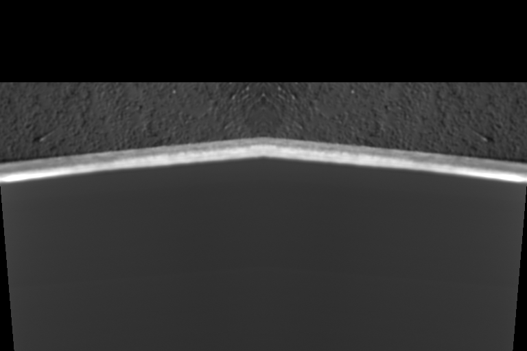

# Selected Area Milling

When simple box-like patterns will not suffice, user of `pytribeam` can utilized the **selected_area** pattern type, which generates a stream file based off a masked image. Originally designed for non-prismatic or non-rectangular sample shapes, this approach enables users to create an image processing workflow based off the ion image taken at the start of the FIB step type to make arbitrary patterns defined on a per-pixel basis. Unlike other supported pattern types, the **selected_area** pattern type has its own set of user defined parameters, including:

- **dwell_us** (*float*): The time to dwell on each pixel in a pass in microseconds, a float. The dwell time must be a positive float *and* an integer multiple of the base dwell time, which is set to 25 ns in the `constants` module.

- **repeats** (*int*): The number of times to repeat the pattern, a positive integer.

- **recipe_file** (*str*): The path to the recipe file that will perform image processing. The parameter must be a valid file path string with the extension `.py` and must already exist. See [Implementation](#implementation) below for more details.

- **mask_file** (*str*): The path to the mask file created by the **recipe_file** script. Must be a valid file path string with the extension `.tif`, and must be created by the time the **recipe_file** script has finished execution.

## Implementation 
In order to utilize the selected area milling functionality, the user must be able to create a `python` script that performs the necessary image processing routine to create a binarized mask. This mask can either be a true binary array image (only values of `True` or `False`), or an integer array of values containing only `0` or `1`. This binary mask will be used to create a stream file.

**NOTE**: Mask arrays containing any other values may not work as expected. Future releases may target the utilization of scalar values to automatically adjust dwell times, but for now only fully binarized masks will create the expected behavior.

When the stream file is created, the provided image is automatically scaled to a width of 4096, with nearest neighbor interpolation only. This means that for a FIB image with horizontal field width of 500 microns, the created stream pattern will have a pixel step size of $\sim120$ nanometers. It is important to take this pixel density into account when selecting the number of **repeats** for the selected area pattern. 

In order to ensure that the stream pattern is scaled correctly, there will also be a single point placed in the upper left corner of the scan field at the start of the stream pattern and a single point in the lower right corner of the scan field at the end of the stream pattern (see [patterning coordinate frame](../../../../reference_frame/README.md#patterning-coordinate-system) for more details). This enforces that the stream file will be executed using the **TopToBottom** scan direction and the **Raster** scan type.

### A working example

Below is an example ion image taken of a sample pedestal in a glancing angle configuration. The image has been manipulated and mirrored across the horizontal axis in order to create a V-shaped area that would represent the area we want to mill. The black regions arise from the image manipulation in order to make a complex shape in cross-section to illustrate the utility of the selected area arpproach. 


*A representative ion beam image taken of a sample pedestal in a glancing angle FIB milling configuration. The image has been synthetically manipulated with a slight rotation and mirroring operations to create a non-prismatic shape ill-suited for conventional box-type patterning geometries. Continued backtilting of the sample (higher degree of glancing) will foreshorten the width of the bright region, which has previously been machined with the laser, while reducing the amount of backtilting (less glancing angle) will increase the width of the bright region. The pedestal appears upside down as we are looking from the perspective of the ion beam, and the black areas are the result of the image manipulation to create an complex geometry region to mill.*

The pedestal appears to be flipped upside down as we are imaging from the perspective of the ion beam. The laser-machined region is the bright V-shaped area near the center of the image, and the textured gray region above this is the side of our sample pedestal. Typically after laser machining the region of interest for glancing angle milling will appear much brighter than the rest of the sample.

We want to create a binarized mask of the V-shaped region of interest in order to create our stream file. The end result of our image processing produces the following image:


*The masked version of the original image after image processing. We have successfuly isolated the V-shaped region of interest without need to draw a much larger box pattern.*

This image was produced with the following script, which we will discuss in further detail below:
```python
<!-- cmdrun type fib_stream_recipe.py -->
```

### The image processing script

Looking at the above script used to generate the binarized mask, we can see there are three main sections to the script. This same rough structure should be maintained for any custom recipe file created by the user. Several of the imports in the first part must be included, and the standard entry point, `if __name__ == "__main__":` section should not be modified by the user. The user should only modify the `process_image` function to achieve the desired image processing routine. More details on the various parts of the script follow below:

-   Part 1, library imports:

    The top several lines contain several `import` statements. Here we are bringing in various libraries, either native to `python` or included in the `pytribeam` package, to perform various tasks. The first two imports are critical and must be included in the final recipe file:
    ```python
    # python standard libraries
    from pathlib import Path
    import sys
    ```
    The remainder of the import statements can be modified by the user depending on the nature of the image processing workflow. This example uses a variety of simple tools (`pillow`, `numpy`, and `scikit-image`) to import, segment, and write out image data that will already be avialable in your `python` environment.

- Part 2: The image processing recipe.

    All of the image processing to generate the desired binarized mask is achieved through the ``process_image()`` function. 
    
    The example script performs the following operations to generate the binarized mask image shown [above](#a-working-example):
        - Import the image using the `Pillow` library
        - Convert the image to a `numpy` array
        - Apply a simple Otsu threshold
        - Remove all but the largest continuous feature:
            - Label connected components
            - Find the largest continuous component
            - Mask the largest component, removing all others
        - Save out the image

    Users may implement their own image processing routines and bring in any other functions or packages they deem necessary or helpful to get their desired result. It is, however, imperative that the users be sure to write out the final image as a `.tif` file before the end of the `process_image()` function. Users should there plan to retain at least the following lines, or something similar, at the end of their `process_image()` function:

    ```python
    # write out image
    mask = pil_img.fromarray(mask)
    mask.save(output_path)

    return True
    ```

- Part 3: The standard entry point.

    Users should not adjust the last several lines of this example, as this is required by `pytribeam` to correctly pass the user-defined settings of where to find the input grayscale ion image (automatically defined by the experimental directory, the step name, and the slice number) and where to save the ouput mask image (the **mask_file** user parameter). These lines allow the initiated subprocess from the main `pytribeam` acquisition loop to parse parameters correctly:
    ```python
    if __name__ == "__main__":
        # Get input and output paths passed from the subprocess:
        input_path = Path(sys.argv[1])
        output_path = Path(sys.argv[2])

        # Process the image
        process_image(
            input_path=input_path,
            output_path=output_path,
        )
    ```

Users can test their script by calling the following, provided they have correctly defined the variables `recipe_file`, `input_image_path` and `mask_file` as strings. The following should create the `mask_file` image at the user-defined location:
```python
import subprocess

output = subprocess.run(
[
    "python",
    recipe_file, # recipe_file
    input_image_path, # input path,
    mask_file, # outputpath,
],
capture_output=True,
)
if output.returncode != 0:
raise ValueError(
    f"Subprocess call did not execute correctly."
)
```

