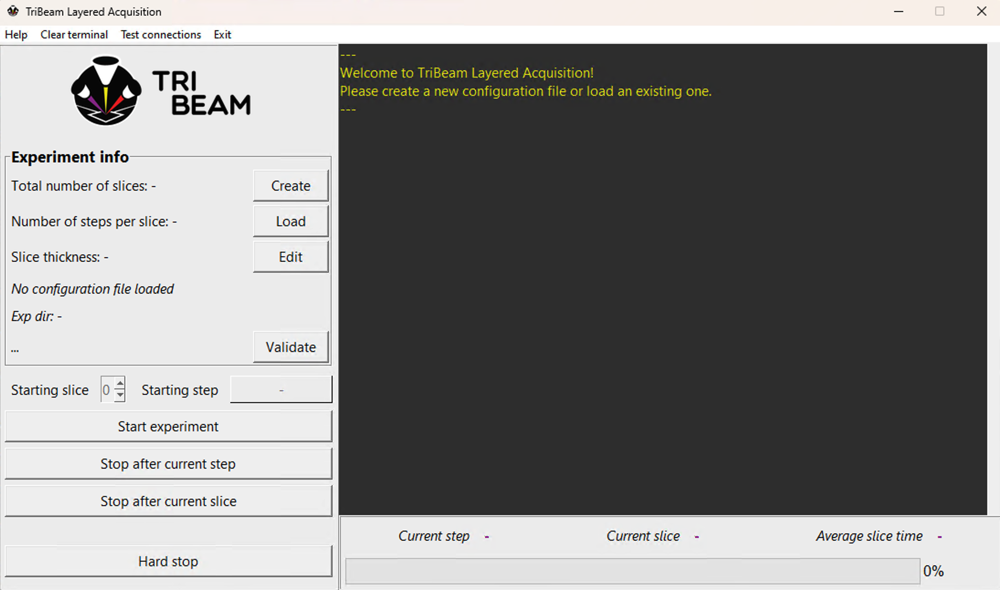

# GUI

``pytribeam`` includes a native GUI built on python standard libraries to assist users with the creation of [configuration files](../config_file/index.html) and to start and monitor experiments. Use of the GUI is the recommended mode of operation of the package, but users can also run an experiment directly from the command line (see [command line interface](../cli/index.html) for more details on this functionality).

After a successful install of the package following the [installation instructions](../installation/index.html), users can launch the GUI in one of two ways:

- running the command ``pytribeam_gui`` from any console. The console must stay open while the GUI application is running.
- running the included ``GUI.ps1`` script with powershell by right-clicking on the icon and selecting "Run with PowerShell". This will only open the GUI window.

Users should see the following landing page when loading the GUI:

The langing page is broken up into several sections, namely:
- [**Menu Bar**](#menu-bar)
- [**Experiment Configuration**](#experiment-configuration)
- [**Acquisition Management**](#acquisition-management)
- [**Acquisition Monitoring**](#acquisition-monitoring)

## Menu Bar

The top menu bar provides various functionalities, including:

- **Help**: This will open the local version of the userguide shipped with the package.
- **Clear terminal**: Clear any messages below the welcome message in the central console window.
- **Test connections**: Checks whether ``pytribeam`` can successfully talk with the Laser and any 3rd party EBSD or EDS detectors. A window will pop-up displaying the results of the test. Thermo Fisher Scientific's Laser application must be open to connect, and EBSD and EDS connectivity additionally requires a connection to the Laser.
- **Exit**: Exits the program. This should not be performed while an acquisition is running, instead the experiment should be stopped as described [below](#acquisition-management).

## Experiment Configuration

The upper-left side of the GUI contains tools for creating, editing, and validating configuration files. A new configuration file can be created by clicking the **Create** button, which opens up a new window with the **TriBeam Configurator**, details on which can be found [here](./configurator/index.html).

Exisiting configuration files can be loaded by clicking the **Load** button, which will open up a file browser. Once a configuration file is created or loaded, the configurator can be reopened by clicking the **Edit** button or validated by clicking the **Validate**  button. Validation includes a ful-suite of checks on configuration files intended to catch any invalid or improper settings that can stop an acquisition from running. This validation is always performed at the start/continuation of an experiment, but its use in the GUI can help to identify any errors prior to the start of an acquisition.

## Acquisition Management

The bottom-left side of the GUI contains various buttons for starting and stopping an acquisition, and also provides the user with direct control over what slice and step to begin acquiring a dataset. This includes the following buttons:

- **Start experiment**: Begin acquisition at the currently displayed starting slice and step.
- **Stop after current step**: Cleanly exit data acquistion at the end of the step currently being exectued.
- **Stop after current slice**: Cleanly exit data acquisiton at the end of the slice currently being collected (will complete all remaining steps on that slice in order).
- **Hard stop**: Stops the experiment as quickly as possible by severing the microscope connection. Control over insertable devices and stage axes already in motion is not guaranteed after this has been pressed, but no additional commands will be sent to the microscope by ``pytribeam`` after this button has been pressed.

## Acquisition Monitoring

The right-side of the GUI contains a large terminal window to capture output from the data acquisition that updates the user on current activities such as stage destination positions, whether detectors are being inserted or retracted, beam voltage adjustments, and more. Any warning or error messages generated during an acquisition will also be output to this terminal. The terminal currently has no limit on output length (10 million ASCII characters, over 100,000 lines, should take less than 10 MB of RAM), but this may change in the future. It is advisable to clear the terminal using the Menu bar when restarting/resuming an experiment to avoid any potential performance issues. Below the terminal window is high-level data related to total experiment progress, the current slice and step, as well as an average slice time.
