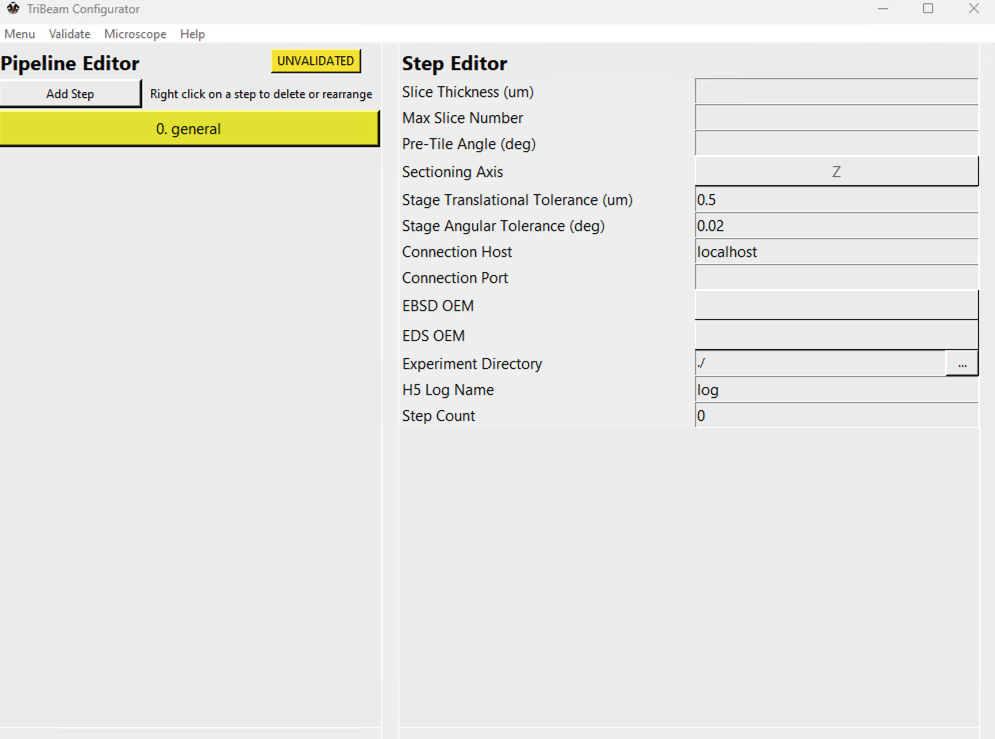

# Configurator

The TriBeam Configurator is a built-in tool for the GUI to assist users with correctly creating experiment configuration files. Upon opening from the main GUI, the user should see the following:

The configurator is principally concerned with creation, editing, saving and validation of `.yml` files that store experiment settings for an entire data acuqisition pipeline. The configurator is broken up into three main sections:

- [**Menu Bar**](#menu-bar)
- [**Pipeline Editor**](#pipeline-editor)
- [**Step Editor**](#step-editor)

## Menu Bar

The menu bar contains several buttons, namely:

- **Menu**: Options for creating new configuration files, loading or saving the current configuration. This contains multiple options:
    - **New**: Create a new configuration file.
    - **Load**: Load an existing configuration file.
    - **Save**: Save/overwrite the current configuration file. Will not attempt to validate the file
    - **Save as**: Save the current configuration file. Will not attempt to validate the file.
    - **Save & Exit**: will attempt to validate the current configuration. If successful, will overwrite and close the configurator.

- **Validate**: Options for validating all or part of the configuration file. The status of the current file (*VALID*, *INVALID*, or *UNVALIDATED*) appears on the right side of the pipeline editor. Validation will report the first error (if any are found) in each respective step. Options include, namely:
    - **Full**: Validate entire configuration file.
    - **Step**: Validate the currently selected step only.
    - **General**: Validate the general settings (considered to be Step 0, but not an operation) only.
**NOTE** A general step must be validated before any individual steps can be validated.

- **Microscope**: Contains various utilities for reading properties directly from the microscope. Users are encouraged to setup stage and imaging conditions manually in xTUI and then utilize these utilities to directly copy settings into the configuration file, which will account for the vast majority of settings. Current utilities include:

    - **Import stage positions...**: Reads current microscope stage position (in RAW stage coordinates) and records these values in the currently selected step. Applies to all step types.
    - **Import imaging conditions...**: Reads current microscope imaging conditions (voltage, current, resolution, detector settings, etc.) for the active quadrant and records these values in the currently selected step. Applies to **Image**, **FIB** and **EBSD_EDS** step types.
    - **Import laser settings...**: Reads current laser settings and records these values (beam settings, patterning, etc.). 
        - **NOTE**: There is currently no method to actively read the **Polarization** parameter from the laser directly, so this value will default to *vertical* polarization automatically. Please manually select *horizontal* polarization after importing laser settings if this configuration is desired. Applies to **Laser** step types.

        **NOTE**: There is currently no method to actively read the **Pattern** settings in a **FIB** step type, these values must be manually input by the user.

- **Version**: Drop-down menu to select the version of configuration file to be completed by the configurator. Different versions of configuration files in future releases will have differing settings parameters to accommodate new features.

## Pipeline Editor

The left side of the configurator shows the layout of the current pipeline. All experiments must start with a general settings step, which captures high-level information about the experiment. Steps can be added by clicking the **Add Step** button, which brings a dropdown menu for the various supported step types. See [here](../../config_file/steps/index.html) for more information on various step types supported by ``pytribeam``. Steps in the pipeline editor are denoted with their sequence, a user-editable step name, and the step type in parentheses.

To adjust the order of operations, right-click on a step to bring up a new dropdown menu for the following:

- **Delete**: Remove the step from the pipeline.
- **Move Up**: Move the selected step one position up in the pipeline.
- **Move Down**: Move the selected step one position down in the pipeline.

## Step Editor

The right-side of the configurator is used for filling out specific settings for a particular step. There are various sections with dropdown menus that can be expanded by clicking on the right-facing triangles on the left side of each section. These sections can similarly be collapsed by clicking the upside-down triangle as desired.

A quick description of each variable can be seen by hovering over the variable name on the left side of the step editor section. 

The step editor contains several different types of inputs, including:

- **open entry boxes**: Receive string, integer, or floating point input, which generally have a wide open bar with left formatted text. Several of these will be grayed out for automatically recorded values (e.g. **Step Number** and **Step Type**, which are determined by the Pipeline Editor). A subset of these are for filepath locations, which additionally have a button with ellipses on it on the far right side that will open a file browser to select the correct path.

- **button selection**: User may select from a list of specifically enumerated values. Examples include **Beam Type** or **Detector Type** for an imaging type step. Some of these may have no filled value, even after using the Microscope utilities described above, and require the user to select the value. For example, the [**Rotation Side**](../../reference_frame/#rotation-side) parameter under Stage settings must be selected by the user.

- **radio buttons**: On/Off selection variables for boolean variables. Examples include **Use Dynamic Focus** and **Use Tilt Correction** in an imaging type step.