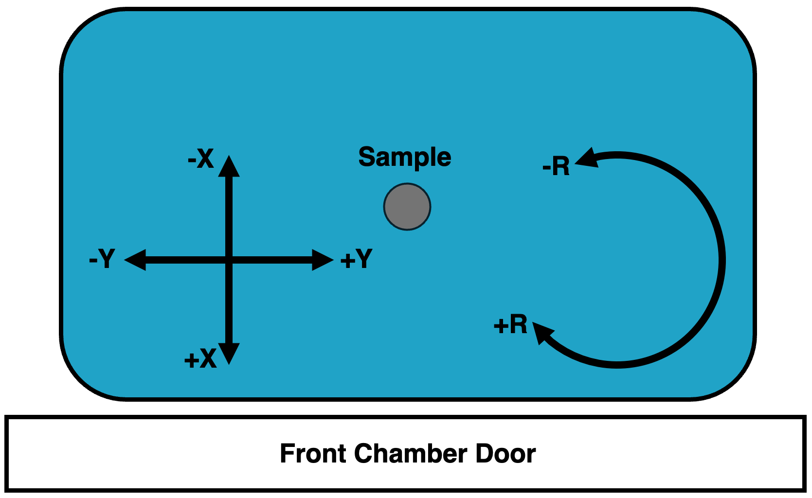
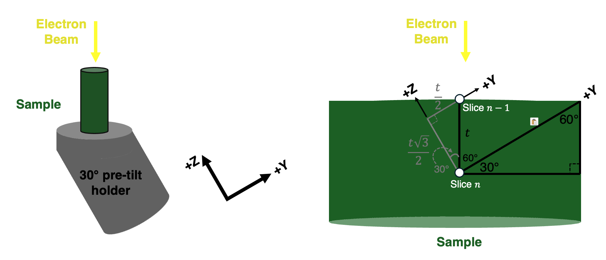

# Reference Frame Conventions

The general approach for 3D data collection adopted by this package is to use stage movements to ensure that the cut face is placed at the same relative distance to each beam regardless of the slice number. Therefore, when imaging the cut face, the electron beam working distance (distance between electron beam and image surface) should remain constant (fixed) over the course of the experiment. `pytribeam` provides automation to control stage movement throughout a serial-sectioning experiment to enable this expected beahvior. 

To achieve the needed stage movements, a slice thickness and initial stage positions (for operations on the first slice) are requested from the user. All subsequent stage positions are calculated on the basis of these initial settings, so in order to ensure the cut face remains at the same working distance and location as the initial cut face, it is important to understand the reference frame conventions utilized by this package.

**WARNING:** Incorrect selections of **sectioning_axis**, and **pre_tilt_deg** in **[General Experiment Settings](../config_file/general/index.html)**, or **rotation_side** in **[General Step Settings](../config_file/steps/general/index.html)** can result in acquisition with incorrect slice thicknesses and an apparent drift of the sample during data collection. This can result in loss of data or failed experiments.

## Stage Axes

The TriBeam has a 5-axis stage, including 3 translational axes (X, Y, Z) amd two angular axes (T, R). The X and Y axes move the sample in-plane around the chamber, while the Z axis brings the stage closer or further from the electron beam pole piece. The angular tilt axis (T) tilts the stage about the X-axis to access different imaging/milling geometries, and the angular rotation axis (R) rotates the sample about the Z-axis for various sample alignment operations.

All stage coordinates are tracked in ThermoFisher's "RAW" coordinate system, which differs from that utilized in the xTUI. The most notable change for users familiar with normal SEM operation is that the positive Z-direction moves the sample stage toward the electron column pole piece, not the working-distance "Z-linked" convetnion direction where Z is measured as the distance between the sample and the electron beam pole piece. 

When facing the front chamber door, with the FIB column to the left of the electron column and the laser (if installed) to the right of the electron column, the following axes conventions are utilized:

- the positive X (+X) direction is coming out of the front chamber door
- the positive Y (+Y) direction is to the right (toward the laser beam)
- the positive Z (+Z) direction is toward the electron column
- the positive T (+T) directions tilts the stage counterclockwise about the X axis
- the positive R (+R) direction rotates the sample clockwise about the Z axis

Ilustrations of these conventions follow below:

*Stage axes side view, as viewed standing in front of the TriBeam and facing the Front Chamber Door.*

*Stage axes top down view, as viewed looking down (bird's eye view) onto the sample stage standing in front of the TriBeam and facing the Front Chamber Door.*

## Pre-tilt angles

In order to access the various geometries required for data collection with all the detectors in the TriBeam, from glancing-angle FIB milling to EBSD collection, a pre-tilted sample is generally required to remain within stage hardware limits. Correctly identifying the pre-tilt used for a TriBeam data acquisition experiment is critical to ensure that the cut face of the sample remains at a consistent working distance throughout the experiment.

In ``pytribeam``, we adopt a pre-tilt convention that tends to differ from most FIB experimentalist conventions, which stems from the difference in milling geometries, namely between surface normal and surface parallel (also called glancing angle) milling. Conventional FIB milling is typically conducted using surface normal geometries, wherein the sample surface is oriented perpendicular to the incoming ion beam to allow the ion beam to effectively "drill" into the sample. However, milling for large volume 3D datasets in ``pytribeam`` adopts a surface parallel milling geometry, where the milled area (or cut face) is set up to be parallel to the incoming beam. In this orientation, only the leading edge of the beam (either laser or ion) interacts with the surface, which has numerous advantages. Pre-tilt angles are therefore measured in terms of glancing-angle geometries, and are therefore typically the complementary angle of the pre-tilt angle convention used by surface normal milling geometries, (i.e., $\theta_{glancing} = 90\degree - \theta_{normal}$).

The pre-tilt angle for ``pytribeam`` of your sample can most readily be found by determining what angle the tilt (T) axis would need to be set to in order to enable surface parallel milling with the laser beam. As the laser beam is mounted with a $60\degree$ offset from parallel with the electron beam in the TriBeam, it will cut into a completely flat sample (perpendicualrly oriented to the electron beam, typical for conventional electron imaging) at a $30\degree$ angle. 

A sample without pre-tilt ($0\degree$ pre-tilt) would need to compensate for this cutting angle and need to be tilted to $+30\degree$ to have its top surface parallel with the incoming laser beam. If a user intends to use $-6\degree$ for their laser milling step, this would signify a pre-tilt of $36\degree$ to align the top surface of the sample parallel to the laser beam during milling. In general, the sum of the tilt angle to orient the top surface of the sample parallel to the laser beam and the pre-tilt angle should therefore be equal to $30\degree$:

$$ \theta_{T\,axis,\,laser\,machining} + \theta_{pre-tilt} = 30\degree $$
 
**WARNING:** This second example utiliing a T axis position of $-6\degree$ for the laser milling step is generally considered to be a $54\degree$ pretilt by FIB convention (the complementary angle of $36\degree$), but will result in incorrect slice thicknesses and sample drift over time if used for a ``pytribeam`` experiment.

## Rotation Side

In order to maintain the sample's working distance and preserve its location in the original field of view throughout an experiment, a pre-tilted sample will generally require a combination of both Z and Y axis movements as material is removed. ``pytribeam`` includes automated stage movement routines that takes these corrections into account to adjust these axes accordingly. As serial-sectioning iteratively removes material, the change in the Z axis position will always be positive given the axis conventions described [above](#stage-axes). However, the direction of the Y axis movement will be determined based on the orientation of the sample and necessary adjustments due to limitations on stage tilt values. This behavior is captured with the **rotation_side** parameter included in stage positions for every step in a ``pytribeam`` workflow, which controls the sign of this movement. This parameter has 3 possible enumerations, including:

- **FSL_MILL**: correction for pre-tilted sample stage movement when the sample is rotated on the side of laser milling operations. Results in a correction along the negative Y direction.
- **FIB_MILL**: correction for pre-tilted sample stage movement when the sample is rotated on the side of ion milling operations. Results in a correction along the positive Y direction.
- **EBEAM NORMAL**: correction for pre-tilted sample stage movement when no pre-tilt adjustment is needed, a special case currently utilized only in custom scripts and not recommended for normal operations.

To explain the use of the normal operating modes, either **FSL_MILL** or **FIB_MILL**, the following example is provided for a sample utilizing a $30\degree$ pre-tilt, and a slice thickness $t$. The correct movement of the sample for subsequent slices can be determined using trigonometry as follows:

### Laser milling step
For a laser milling step, the user should select **FSL_MILL** for the **rotation_side** step setting, which correctly adjusts the Y axis position along the negative direction for this operation. 

In this step, the stage tilt will remain at $0\degree$ as the pre-tilt angle is $30\degree$ as discussed [above](#pre-tilt-angles). The sample surface forms the long leg of a 30-60-90 triangle, with the slice thickness (the movement of the sample from Slice $n$ to its previous location on Slice $n-1$) forming the short leg (black triangle). Using geometric properties of triangles, the Y and Z axis movements required to achieve the desired slice thickness can be decomposed into an additional inner 30-60-90 triangle (gray triangle) to calculate the absolute Y and Z axis moves required. For a slice thickness $t = 10.0\, \mu m$, the Z axis must move $\frac{t\sqrt{3}}{2} = 8.66 \, \mu m$ in the positive direction and the Y-axis must move $\frac{t}{2} = 5.00\, \mu m$ in the negative direction. This is illustrated below:

*Geometric calculation of stage movements required to bring the sample surface to the fixed milling location, which involves moving the Y and Z axes to bring point **Slice n** to point **Slice n-1**.*

### Electron imaging step (surface normal imaging)
For an electron imaging step, it may be advantageous to have the cut sample surface perpendicular to the electron beam to reduce distortions and the need for additional post-processing that arises from imaging of tilted sample surfaces. However, it may not be possible to achieve a $-30\degree$ sample tilt on the T axis necessary to achieve this orientation for the pretilted sample as described. Luckily, this geometry can still be achieved if the sample is first rotated by $180\degree$ using the R axis. This will then enable the user to orient the cut sample surface perpendicular to the electron beam by tilting the stage T axis to $+30\degree$ to offset the pre-tilt.

As we have rotated the sample $180\degree$ for this operation the user should select **FIB_MILL** for the **rotation_side** step setting, which correctly adjusts the Y axis position along the positive direction for this operation. 

In this step, the $30\degree$ rotation of the tilt axis T rotates the Z and Y axes as well, so we can use geometric properties of parallel lines and triangles to find the correct orientation of the 30-60-90 triangle in this case, with the slice thickness (the movement of the sample from Slice $n$ to its previous location on Slice $n-1$) forming the short leg (black triangle). Using geometric properties, the Y and Z axis movements required to achieve the desired slice thickness can be decomposed into an additional outer 30-60-90 triangle (gray triangle) to calculate the absolute Y and Z axis moves required. For a slice thickness $t = 10.0\, \mu m$, the Z axis must move $\frac{t\sqrt{3}}{2} = 8.66 \, \mu m$ in the positive direction and the Y-axis must move $\frac{t}{2} = 5.00\, \mu m$, now in the positive direction. This is illustrated below:

*Geometric calculation of stage movements required to bring the sample surface to the fixed imaging location, which involves moving the Y and Z axes to bring point **Slice n** to point **Slice n-1**.*

Note that the magnitude of the stage movement is the same for both axes for both the [laser milling step](#laser-milling-step) and the [electron imaging step](#electron-imaging-step-surface-normal-imaging), but that the sign of the Y axis movement is opposite due to the rotation of the stage. This is the critical functinoality of the **rotation_side** parameter.