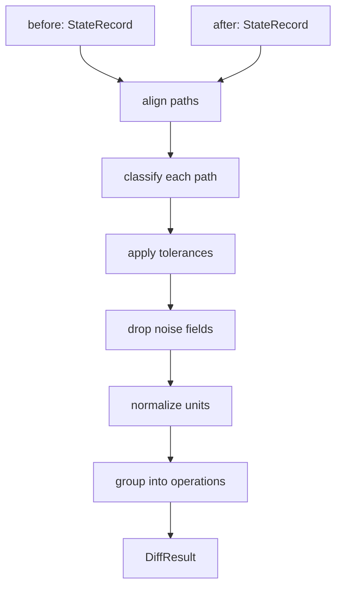

# pytribeam MCP

This document should be treated as an ongoing roadmap for MCP incorporation 
into the project. If something here contradicts what you find in the repo, 
the repo is probably right and this document is stale — say so and we will 
fix it.

---

## 1. What we are building, in plain terms

We have a very expensive microscope in a lab. It is controlled by a Python
package called `pytribeam`, which wraps the vendor's API (`AutoScript`). We 
want to let an AI agent operate parts of it — starting with reading the
machine's settings and eventually taking images. As we know, the bridge between
an agent and a program is a protocol called MCP (Model Context Protocol). We 
are building an MCP *server*: a program that exposes a fixed menu of operations
that an agent is allowed to invoke.

The first and most important layer of this project is **understanding what
changed on the microscope between two points in time.**

Concretely, we can already record the microscope's entire state to a YAML
file. Given two of those recordings, we want to answer: *what is different,
which differences are real, and what operation would explain them?* That 
question is pure data processing, doesn't need a microscope, the vendor 
software, or any physics background.

---

## 2. The microscope, in 60 seconds

Think of the microscope as **a device with a large tree of named properties**. 
Some can be read. Some can be written. A few are dangerous to write. A recorded 
state is a flat snapshot of that tree: a couple hundred `path -> value` pairs, 
where a path looks like `specimen.stage.current_position.x`.

That is genuinely all you need for Work Packages 1 and 2. The glossary below
is so the names stop looking like noise, not because you need to understand
the instrument.

### Minimal glossary

| Term | What it means for you |
|---|---|
| **SEM / FIB** | Two "beams" the machine can image with — an electron beam and an ion beam. Paths under `beams.electron_beam.*` and `beams.ion_beam.*`. |
| **Stage** | The motorized platform holding the sample. Five axes: `x`, `y`, `z` (position, in **meters**) and `t`, `r` (tilt and rotation, in **radians**). |
| **HFW** (`horizontal_field_width`) | How wide a region the image covers, in meters. Smaller HFW = more zoomed in. Changing it is the most common "imaging conditions" change. |
| **Working distance** | Distance from the lens to the sample, in meters. Affects focus. |
| **Dwell time** | How long the beam sits on each pixel. Longer = slower scan, less noise. |
| **Detector** | Sensor that turns the beam signal into an image. Has a type, a mode, and brightness/contrast settings. |
| **Quad** | The microscope UI shows four image panels, numbered 1–4. Each displays some device. Paths like `imaging.quad1.active_device`. |
| **EDS / EBSD** | Two other kinds of measurement the machine can do. You will see the names; you can ignore them for now. |
| **Pre-tilt** | The sample holder is often built at a fixed angle. Matters later, not for you. |

Two things that will bite you if you don't know them:

- **Everything is in SI base units.** Meters and radians, not millimeters and
  degrees. A stage position of `0.001234` is 1.234 mm. This is why the units
  table in WP2 exists — a human reading `0.001234` will guess wrong, and so
  will an AI agent.
- **Floating point noise is everywhere.** The stage encoders report slightly
  different numbers every time you read them even when nothing moved. Telling
  real changes from noise is a core part of your job, not an edge case.

---

## 3. Setup

You need a Python between 3.8.12 and 3.11.14 (see `pyproject.toml` --
anything newer, including 3.11.15+, is rejected by the package metadata).
Create a virtualenv or conda env in that range, then from the repo root:

```
pip install -e ".[dev]"
```

This installs pytribeam's real dependencies (numpy, pandas, PyYAML, Pillow,
etc.) and pytest. It does **not** install AutoScript -- that package isn't a
public dependency and isn't in `pyproject.toml` at all, which is exactly why
`state/` can be developed here. Confirm it:

```
python -c "import autoscript_sdb_microscope_client"   # should fail
python -c "import pytribeam.mcp.state.diff"            # should succeed
```

Then run your first (currently failing, that's expected) test:

```
pytest tests/mcp/ -v
```

You should see the import-boundary tests pass and every `test_diff.py` test
fail with an `AttributeError` -- `diff.py` and `metadata.py` don't have
`diff_records`/`load` yet. That's the starting line, not a broken setup.

---

## 4. Repo tour

Everything you will touch is under `src/pytribeam/mcp/`.

```
src/pytribeam/mcp/
├── __main__.py          entry point (WP3)
├── server.py            MCP tool definitions (WP3)
├── config.py            server settings, safety limits (later)
├── results.py           structured success/failure return types (WP3)
│
├── state/               ← YOUR WORK LIVES HERE
│   ├── schema.py        DONE — record format, load/save
│   ├── capture.py       DONE — reads the microscope (needs hardware)
│   ├── normalize.py     STUB — WP1: units, display formatting (header only)
│   ├── diff.py          STUB — WP1: the comparison engine (contract + docs, no code)
│   ├── metadata.py      STUB — WP2: path metadata lookup (contract + docs, no code)
│   └── path_metadata.yml SEEDED — WP2: enough entries to cover the fixtures;
│                                  extend it, don't start over
│
└── capabilities/        (WP4 — not yours yet)
    ├── registry.py
    ├── read.py
    ├── stage.py
    └── imaging.py
```

`diff.py` and `metadata.py` aren't blank — each has a docstring specifying
the exact function signatures and return shape you need to implement (see
"Required public API" in each file). That contract is what
`tests/mcp/test_diff.py` calls. You choose everything below that surface.

**The one architectural rule you must not break:**

> Nothing in `state/` may import `autoscript_sdb_microscope_client`,
> `pytribeam.types`, `pytribeam.utilities`, or `pytribeam.constants`.

Those imports require the vendor software, which only exists on the lab
machine (the last two only indirectly -- both import `pytribeam.types` at
module scope, so importing either one still poisons `state/`).  `state/` has
to run on your laptop. `capture.py` is the single exception — it talks to the
hardware, and it is already written, so you should not need to touch it.

`tests/mcp/test_import_boundary.py` enforces this with an AST walk over every
file in `state/` except `capture.py`. It already passes. If you see it fail,
you added an import you shouldn't have; don't "fix" the test.

---

## 5. The data you are working with

Read `state/schema.py` first — it is short and it defines everything.

A recorded state looks like this:

```yaml
schema_version: '1.0'
id: s0002
recorded_at: '2026-07-15T14:14:13.115-06:00'
description: Moved to feature A
intended_action: move_stage
provenance:
  pytribeam_version: 0.1.4
  autoscript_version: 4.7.1
  host: localhost
  hostname: TRIBEAM-PC
  recorded_by: state_recorder
read_errors:
  - path: beams.ion_beam.beam_current.value
    error: 'ApplicationServerException: beam is off'
    kind: access
values:
  specimen.stage.current_position.x: 0.001891
  specimen.stage.current_position.y: -0.000385
  beams.electron_beam.horizontal_field_width.value: 0.000075
  imaging.quad1.active_device: ELECTRON_BEAM
  # ...roughly a thousand more
```

Points worth noticing:

- **`values` is flat.** The subsystem is just the first component of the path.
  Do not re-nest it.
- **`read_errors` is not decoration.** A path can be missing from `values`
  because it stopped existing, *or* because reading it raised. Those mean
  completely different things and your diff must not conflate them.
- **`intended_action`** is what the operator *says* they did. **It is not
  ground truth and your diff must never be tested against it.** It exists for
  manual sessions where no step config exists, and so the diff can eventually
  surface disagreement between stated intent and observed effect. Fixture
  3→4 (below) is a real example of the operator's stated intent not matching
  what the state actually shows — keep that disagreement, don't "fix" it by
  changing the fixture or the diff.
- **`provenance`** matters because comparing states recorded under different
  software versions is legitimate but worth flagging.

Load records with `schema.read_record(directory, record_id)` (or
`read_record_file(path)` for a bare file). The real fixtures are at
`tests/mcp/state_records/`: `index.yml` plus `states/s0001.yml` ...
`s0009.yml`, exactly as the recorder produced them from one real session —
don't restructure this into `before.yml`/`after.yml` pairs, that would throw
away the session ordering. Ground truth for what a diff between two of these
states should produce lives in the sibling `tests/mcp/expected/` directory,
one file per transition, named `<before_id>_<after_id>.yml` (e.g.
`s0002_s0003.yml`). `tests/mcp/test_diff.py` is already parametrized over all
nine of these pairs.

---

## 6. Work package 1 — the diff engine

**Goal:** given two `StateRecord` objects, produce a structured description of
what changed.

**Files:** `state/normalize.py`, `state/diff.py`
**Tests:** `tests/mcp/test_diff.py` (already written, currently failing)
**Hardware needed:** none

### The pipeline



### Classifying a path

Every path that appears in either record gets exactly one classification:

| Classification | When |
|---|---|
| `changed` | In both, values differ by more than tolerance |
| `unchanged` | In both, values equal or within tolerance |
| `appeared` | Absent from before, present in after |
| `disappeared` | Present in before, absent from after |
| `read_error_before` | Absent from before.values, and it or an ancestor is in **before**'s `read_errors` |
| `read_error_after` | Absent from after.values, and it or an ancestor is in **after**'s `read_errors` |
| `noise` | Marked `noise: true` in the metadata table |

Only `changed`, `appeared`, `disappeared`, and the two read-error cases go in
the output by default. `unchanged` and `noise` are counted but not listed.

**The ancestor rule — the part that actually trips people up.** A read error
is recorded at the node where the read threw, which is often an interior
node, not the leaf path you're comparing. Fixture `s0008_s0009` (compustage
coming online, stage going offline) is built specifically to exercise this:
`specimen.stage.current_position` starts erroring as a whole object, so its
six children — `.x .y .z .t .r .coordinate_system` — vanish from `values`
without any of them individually appearing in `read_errors`. An exact-path
lookup against `read_errors` will confidently classify all six as
`disappeared`, which is wrong. Walk ancestors. Same fixture exercises the
reverse direction too (`specimen.compustage.current_position.*` going from
erroring to readable) — see `test_ancestor_rule_both_directions` in
`test_diff.py`.

### Tolerances

This is the part people get wrong. Rules:

- Non-numeric values (strings, booleans, `None`): exact comparison.
- Numeric values with an absolute `tolerance` in the metadata: unchanged if
  `abs(after - before) <= tolerance`.
- Numeric values with a relative `tolerance_ratio`: unchanged if
  `abs(after - before) <= tolerance_ratio * max(abs(before), abs(after))`.
- If both are given: unchanged if **either** test passes.
- If neither is given: exact comparison, and the path is also reported in an
  `unmapped` list so we know the table needs an entry.

The four tolerance seeds (stage translational/angular, beam voltage/current)
and the two detector ones (brightness/contrast, dwell time) are already in
`path_metadata.yml`, derived from `steps.yml` and from
`pytribeam.constants.Constants` (`beam_dwell_tol_ratio`,
`contrast_brightness_tolerance`) — read the comments next to each entry for
where the number came from. **Copy numbers into the metadata table, never
import `pytribeam.constants`** — that module pulls in the vendor package.
Ask before adding a new tolerance you didn't get from the instrument team;
several paths (HFW, for instance) are deliberately left without one for now.

### Grouping into operations

A single physical action changes several paths at once. Moving the stage
changes all five axis values. Reporting that as five independent differences
is technically true and practically useless.

So: each metadata entry may name a `capability`. Group the `changed` paths by
capability. Paths with no capability go into a single `observed` group —
things that changed but that we cannot cause directly. `path_metadata.yml`
already defines four: `move_stage`, `set_hfw`, `set_scan_parameters`, and
`set_active_view` (detector fields + `imaging.active_view` together — see
"scoped fields" below for why).

If the after-record has an `intended_action`, you may compare it to the
inferred groups and report agreement or disagreement, but **never let the
diff depend on it** — it's often absent (`null` for both s0008 and s0009),
and its vocabulary is *finer-grained* than the capability ids on purpose
(e.g. a state might claim `set_detector_type` and `set_detector_levels`
separately, both of which land under the one `set_active_view` capability
here). Fixture `s0003_s0004` is the sharpest example of why this separation
matters: the state's `intended_action` claims a detector type change that
demonstrably did not happen (see finding in the issue tracker on detector
settings not applying on electron-beam steps) — a diff that trusted
`intended_action` would report a change that isn't in the data.

### Scoped fields

A value can be scoped to another path — its meaning depends on what that
other path currently is. `detector.*` is scoped to `imaging.active_view`:
switching the active view swaps in a different physical detector's readout
wholesale (verified against fixtures `s0005_s0006` and `s0006_s0007`, where
`detector.type.value` flips completely and flips back). If a scoped path's
`changed` and its scope key *also* changed in the same pair, mark it —
`path_metadata.yml`'s `scoped_by` field, surfaced per-difference as
`scoped_by` in the output — **don't drop it**. An agent that sees "detector
changed" with no annotation, when really the operator just looked at a
different panel, will draw the wrong conclusion. Flagging costs nothing;
silently dropping a real value change does not get a second chance.

### Output shape

`diff.py`'s docstring ("Required public API") specifies the exact contract:
a `diff_records(before, after, path_metadata) -> DiffResult` function and a
`DiffResult.to_dict()` whose shape you can see directly in any file under
`tests/mcp/expected/`. Read the docstring before you design anything — the
call signature and top-level keys are fixed; how you build `DiffResult`
internally is entirely yours.

Add a plain-text renderer too (`render_text(result)`, also specified in the
docstring). Something close to the format in `GUI/state_recorder_dev.md`
(that path is relative to `src/pytribeam/`, i.e.
`src/pytribeam/GUI/state_recorder_dev.md`):

```
s0001 -> s0002  (9.99 s)
Note: Moved to feature A
Inferred: move_stage  (matches intended_action)

Changed:
  specimen.stage.current_position.x   1.234 mm -> 1.891 mm
  specimen.stage.current_position.y  -0.412 mm -> -0.385 mm

Suppressed: 4 within tolerance, 12 noise
```

### Acceptance criteria

`tests/mcp/test_diff.py` passes — it's already written and currently fails
with `AttributeError`, because `diff_records`/`metadata.load` don't exist
yet. It's parametrized over all nine adjacent pairs in the fixture session
plus the non-adjacent `s0001`/`s0007` pair, and separately names each of the
criteria below as its own test:

1. `s0001` vs `s0007` (non-adjacent, otherwise identical) produces **zero**
   reported changes.
2. `s0001`→`s0002` reports exactly the three stage axes that moved, grouped
   as one `move_stage` operation.
3. `s0004`→`s0005` reports HFW and stage separately, as two capabilities
   (note: the stage change here is tilt-only, despite the state's own
   description saying "move to another spot" — accurate, not a fixture bug).
4. `s0008`→`s0009` classifies both directions of the ancestor rule
   correctly (see "Classifying a path" above) — six paths as
   `read_error_after`, eight as `read_error_before`, none of them
   individually named in `read_errors`.
5. Records with different `provenance.pytribeam_version` still diff, with
   the mismatch flag set (no session fixture has this naturally, so this one
   uses two small synthetic records built inline in the test).
6. `s0007`→`s0008` (`beams.electron_beam.is_on`, deliberately left out of
   `path_metadata.yml`) appears in `unmapped`.

---

## 7. Work package 2 — path metadata

**Files:** `state/metadata.py`, `state/path_metadata.yml`
**Hardware needed:** none

`path_metadata.yml` is already seeded with enough entries to cover the nine
fixture states — read it before writing `metadata.py`, it's the spec and the
data at once, and every entry has a comment saying where its numbers came
from. You build the lookup machinery (`metadata.py`'s "Required public API"
docstring has the exact contract). The domain experts fill in *new* entries.
Keep those two jobs separate — do not invent tolerance values yourself, ask
(several paths, like HFW, are deliberately left without a tolerance for this
exact reason).

### Table format

```yaml
paths:
  "specimen.stage.current_position.x":
    units: m
    display: mm
    tolerance: 5.0e-7
    capability: move_stage
  "beams.*.horizontal_field_width.value":
    units: m
    display: um
    capability: set_hfw
  "detector.brightness.value":
    tolerance: 1.0e-4
    scoped_by: imaging.active_view   # see WP1 "Scoped fields"
    capability: set_active_view
  "state.specimen_current.value":
    noise: true

capabilities:
  move_stage:
    tier: 2
    affects: ["specimen.stage.current_position.*"]
    summary: "Move the stage to an absolute position"
  set_hfw:
    tier: 1
    affects: ["beams.*.horizontal_field_width.value"]
    summary: "Set the imaging field width"
```

`scoped_by` is optional and orthogonal to everything else on an entry: it
names another path whose value determines what *this* path's value means.
The diff must not report a scoped path's change as an independent fact when
its scope key also changed in the same pair — flag it (`scoped_by` on the
difference), don't drop it. See WP1's "Scoped fields" section for the
`detector.*` / `imaging.active_view` case this exists for.

### Matching rules — implement exactly this

Patterns use `*` as a wildcard over any characters including dots. Several
patterns can match one path. The winner is decided by, in order:

1. Fewest wildcards.
2. Then longest literal (non-wildcard) character count.
3. Then first occurrence in the file.

Write this as its own tested function before using it anywhere. Ambiguous
matching is the kind of bug that produces wrong answers quietly for months.

### Also provide

- `report_unmapped(record, path_metadata)` — list paths in a record with no
  metadata entry. The microscope's API changes between vendor versions, and
  we want new properties to show up as a list rather than as silence. This
  is a whole-record audit, distinct from `diff.py`'s own `unmapped` list,
  which is scoped to paths that came out `changed` with no entry at all —
  see `diff.py`'s docstring for that distinction if it's unclear.
- A validator, run from `load()`, that fails on: a `capability` referencing
  an id not in `capabilities`, malformed patterns, and both `noise: true`
  and a `capability` on the same entry.

### Two rules that are not up for discussion

**Absence means read-only.** A path with no metadata entry, or an entry with no
`capability`, is never writable. Not "unknown," not "probably fine" — read
only. This software drives a motorized stage inside a vacuum chamber with
sensitive detectors nearby. A bug that makes something writable when it
shouldn't be can destroy a sample or crash hardware into hardware.

**The YAML never names Python.** Entries name a capability *id* like
`move_stage`. Later, a hand-written registry maps ids to actual functions. It
would be shorter to write `capability: pytribeam.stage.move_axis` and use
`getattr` — do not do that. It turns a config file into "run any function in
the package," which is exactly the thing we cannot allow near this hardware.
If an id is not in the registry, the field is read-only regardless of what the
YAML says.

---

## 8. Work package 3 — the MCP server

Do not start this until WP1 and WP2 are done and tested. It is listed here so
you know where it goes.

You will implement `server.py` with a handful of read-only tools —
`list_states`, `get_state`, `diff_states` — backed entirely by the code you
wrote. Still no microscope: the server runs against recorded files.

You will pick up MCP itself then. There is no point learning the protocol
before there is something to serve.

---

## 9. How to work on this

**Week one, roughly in order:**

1. Do the Setup steps above, then read `state/schema.py`. Load a couple of
   states from `tests/mcp/state_records/` (`schema.read_record(dir, "s0001")`)
   and print them.
2. Write the glob matcher in `metadata.py` with its own tests. Small,
   isolated, entirely specified above. `path_metadata.yml` already has
   several wildcard patterns (`beams.*.horizontal_field_width.value`, etc.)
   to test it against.
3. Extend `path_metadata.yml` if you find fixture paths it doesn't cover —
   it's seeded, not exhaustive. Don't invent tolerances; ask.
4. Write `normalize.py`: unit conversion and value formatting.
5. Write `diff.py` until `test_diff.py` goes green.
6. Add the text renderer.

**When to ask instead of guessing.** Ask about anything in this list rather
than picking something reasonable:

- What tolerance a particular field should have.
- Whether a field is noise.
- Whether a change is something we can cause or only observe.
- What a path name means physically.
- Anything where a wrong answer would let an agent write to something.

Guessing on the mechanism is fine and expected. Guessing on the physics is
not, and nobody will think less of you for asking — the people who know the
instrument cannot read your matcher either.

**Working with the fixtures.** `tests/mcp/state_records/` is nine states
(`s0001`-`s0009`) from one real session on a virtual/simulator microscope,
plus the `steps.yml` config that produced states 1-7 (8 and 9 are manual,
uncommanded actions — no step config, `intended_action: null`). Each
adjacent pair, plus the non-adjacent `s0001`/`s0007`, exercises something
specific — see the acceptance criteria above for four of them, and just read
the fixture files for the rest if you're curious what a given pair looks
like. Two things about this data specifically:

- **No float jitter anywhere.** It's simulator data, so `s0001` and `s0007`
  compare exactly equal, not just within tolerance. That's real, not a bug —
  but it also means your tolerance code isn't truly exercised against jitter
  by these fixtures alone. A capture from real hardware will eventually be
  needed to close that gap; it doesn't block WP1.
- **Read errors are mostly a static fingerprint of this particular
  simulated microscope**, not something that changes session to session —
  16 of 19 are permanent ("not supported on this microscope"). Only the
  compustage-related ones are state-dependent, which is the entire reason
  fixture `s0008_s0009` exists.

If you need a fixture beyond these nine, ask — do not synthesize one by
hand-editing YAML values. Hand-written numbers have no encoder noise, so
tolerance code tested against them looks correct while being untested
against the thing it exists for.

---

## 10. Reference

- `state/schema.py` — record format. Start here.
- `state/capture.py` — how records are produced. Worth reading once for
  context; you should not need to modify it.
- `state/diff.py`, `state/metadata.py` — read the "Required public API"
  docstring in each before writing anything. That's the contract
  `test_diff.py` calls.
- `tests/mcp/expected/*.yml` — worked examples of exactly what a correct
  diff should produce, one per fixture pair.
- `src/pytribeam/GUI/state_recorder_dev.md` — the operator-facing notes,
  including the original sketch of the diff output format.
- `docs/` — the pytribeam user guide, if you get curious about the instrument.

Questions about the microscope go to the team. Questions about the code go in
a PR comment or an issue — if something in this document was unclear, that is
worth an issue too.
