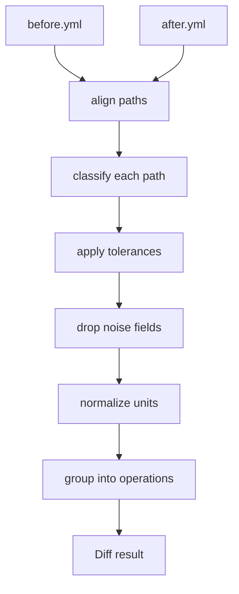

# pytribeam MCP

This document should be treated as an ongoing roadmap for MCP incorporation 
into the project. If something here contradicts what you find in the repo, 
the repo is probably right and this document is stale — say so and we will 
fix it.

---

## 1. What we are building, in plain terms

We have a very expensive microscope in a lab. It is controlled by a Python
package called `pytribeam`, which wraps the vendor's API (`AutoScript`). We 
want to let an AI agent operate parts of it — starting with reading the
machine's settings and eventually taking images. As we know, the bridge between
an agent and a program is a protocol called MCP (Model Context Protocol). We 
are building an MCP *server*: a program that exposes a fixed menu of operations
that an agent is allowed to invoke.

The first and most important layer of this project is **understanding what
changed on the microscope between two points in time.**

Concretely, we can already record the microscope's entire state to a YAML
file. Given two of those recordings, we want to answer: *what is different,
which differences are real, and what operation would explain them?* That 
question is pure data processing, doesn't need a microscope, the vendor 
software, or any physics background.

---

## 2. The microscope, in 60 seconds

Think of the microscope as **a device with a large tree of named properties**. 
Some can be read. Some can be written. A few are dangerous to write. A recorded 
state is a flat snapshot of that tree: a couple hundred `path -> value` pairs, 
where a path looks like `specimen.stage.current_position.x`.

That is genuinely all you need for Work Packages 1 and 2. The glossary below
is so the names stop looking like noise, not because you need to understand
the instrument.

### Minimal glossary

| Term | What it means for you |
|---|---|
| **SEM / FIB** | Two "beams" the machine can image with — an electron beam and an ion beam. Paths under `beams.electron_beam.*` and `beams.ion_beam.*`. |
| **Stage** | The motorized platform holding the sample. Five axes: `x`, `y`, `z` (position, in **meters**) and `t`, `r` (tilt and rotation, in **radians**). |
| **HFW** (`horizontal_field_width`) | How wide a region the image covers, in meters. Smaller HFW = more zoomed in. Changing it is the most common "imaging conditions" change. |
| **Working distance** | Distance from the lens to the sample, in meters. Affects focus. |
| **Dwell time** | How long the beam sits on each pixel. Longer = slower scan, less noise. |
| **Detector** | Sensor that turns the beam signal into an image. Has a type, a mode, and brightness/contrast settings. |
| **Quad** | The microscope UI shows four image panels, numbered 1–4. Each displays some device. Paths like `imaging.quad1.active_device`. |
| **EDS / EBSD** | Two other kinds of measurement the machine can do. You will see the names; you can ignore them for now. |
| **Pre-tilt** | The sample holder is often built at a fixed angle. Matters later, not for you. |

Two things that will bite you if you don't know them:

- **Everything is in SI base units.** Meters and radians, not millimeters and
  degrees. A stage position of `0.001234` is 1.234 mm. This is why the units
  table in WP2 exists — a human reading `0.001234` will guess wrong, and so
  will an AI agent.
- **Floating point noise is everywhere.** The stage encoders report slightly
  different numbers every time you read them even when nothing moved. Telling
  real changes from noise is a core part of your job, not an edge case.

---

## 3. Repo tour

Everything you will touch is under `src/pytribeam/mcp/`.

```
src/pytribeam/mcp/
├── __main__.py          entry point (WP3)
├── server.py            MCP tool definitions (WP3)
├── config.py            server settings, safety limits (later)
├── results.py           structured success/failure return types (WP3)
│
├── state/               ← YOUR WORK LIVES HERE
│   ├── schema.py        DONE — record format, load/save
│   ├── capture.py       DONE — reads the microscope (needs hardware)
│   ├── normalize.py     EMPTY — WP1: units, display formatting
│   ├── diff.py          EMPTY — WP1: the comparison engine
│   ├── metadata.py      EMPTY — WP2: path metadata lookup
│   └── path_metadata.yml EMPTY — WP2: the table itself
│
└── capabilities/        (WP4 — not yours yet)
    ├── registry.py
    ├── read.py
    ├── stage.py
    └── imaging.py
```

**The one architectural rule you must not break:**

> Nothing in `state/` may import `autoscript_sdb_microscope_client`,
> `pytribeam.types`, or `pytribeam.utilities`.

Those imports require the vendor software, which only exists on the lab
machine. `state/` has to run on your laptop. `capture.py` is the single
exception — it talks to the hardware, and it is already written, so you should
not need to touch it.

There is a test that enforces this. If you see it fail, you added an import
you shouldn't have; don't "fix" the test.

---

## 4. The data you are working with

Read `state/schema.py` first — it is short and it defines everything.

A recorded state looks like this:

```yaml
schema_version: '1.0'
id: s0002
recorded_at: '2026-07-15T14:14:13.115-06:00'
description: Moved to feature A
intended_action: move_stage
provenance:
  pytribeam_version: 0.1.4
  autoscript_version: 4.7.1
  host: localhost
  hostname: TRIBEAM-PC
  recorded_by: state_recorder
read_errors:
  - path: beams.ion_beam.beam_current.value
    error: 'ApplicationServerException: beam is off'
    kind: access
values:
  specimen.stage.current_position.x: 0.001891
  specimen.stage.current_position.y: -0.000385
  beams.electron_beam.horizontal_field_width.value: 0.000075
  imaging.quad1.active_device: ELECTRON_BEAM
  # ...roughly a thousand more
```

Points worth noticing:

- **`values` is flat.** The subsystem is just the first component of the path.
  Do not re-nest it.
- **`read_errors` is not decoration.** A path can be missing from `values`
  because it stopped existing, *or* because reading it raised. Those mean
  completely different things and your diff must not conflate them.
- **`intended_action`** is what the operator says they did. It is your
  ground truth for testing, and later it is what a diff should be able to
  infer on its own.
- **`provenance`** matters because comparing states recorded under different
  software versions is legitimate but worth flagging.

Load records with `schema.read_record_file(path)`. Test fixtures live as
directories containing `before.yml`, `after.yml`, and `expected.yml`.

---

## 5. Work package 1 — the diff engine

**Goal:** given two `StateRecord` objects, produce a structured description of
what changed.

**Files:** `state/normalize.py`, `state/diff.py`
**Tests:** `tests/mcp/test_diff.py` (already written, currently failing)
**Hardware needed:** none

### The pipeline



### Classifying a path

Every path that appears in either record gets exactly one classification:

| Classification | When |
|---|---|
| `changed` | In both, values differ by more than tolerance |
| `unchanged` | In both, values equal or within tolerance |
| `appeared` | Absent from before, present in after |
| `disappeared` | Present in before, absent from after |
| `read_error_before` | In `read_errors` of before |
| `read_error_after` | In `read_errors` of after |
| `noise` | Marked `noise: true` in the metadata table |

Only `changed`, `appeared`, `disappeared`, and the two read-error cases go in
the output by default. `unchanged` and `noise` are counted but not listed.

### Tolerances

This is the part people get wrong. Rules:

- Non-numeric values (strings, booleans, `None`): exact comparison.
- Numeric values with an absolute `tolerance` in the metadata: unchanged if
  `abs(after - before) <= tolerance`.
- Numeric values with a relative `tolerance_ratio`: unchanged if
  `abs(after - before) <= tolerance_ratio * max(abs(before), abs(after))`.
- If both are given: unchanged if **either** test passes.
- If neither is given: exact comparison, and the path is also reported in an
  `unmapped` list so we know the table needs an entry.

Reuse the constants already in `pytribeam.constants.Constants` as defaults
where they exist (`voltage_tol_ratio`, `current_tol_ratio`, and the stage
tolerances) — but **copy the numbers into the metadata table**, don't import
`pytribeam.constants`. That module pulls in the vendor package.

### Grouping into operations

A single physical action changes several paths at once. Moving the stage
changes all five axis values. Reporting that as five independent differences
is technically true and practically useless.

So: each metadata entry may name a `capability`. Group the `changed` paths by
capability. Paths with no capability go into a single `observed` group —
things that changed but that we cannot cause directly.

If the after-record has an `intended_action`, compare it to the inferred
groups and report agreement or disagreement. Do not make the diff *depend* on
`intended_action` — it is often absent, and eventually we want the diff to
work without it.

### Output shape

Design the dataclass yourself, but it must carry at least:

- the two record ids and timestamps
- a list of per-path differences, each with: path, subsystem, classification,
  before value, after value, display values with units, capability
- the operation groups
- read-error deltas
- unmapped paths
- a provenance mismatch flag
- counts of everything suppressed

Add a plain-text renderer too. Something close to the format in
`state_recorder_dev.md`:

```
s0001 -> s0002  (9.99 s)
Note: Moved to feature A
Inferred: move_stage  (matches intended_action)

Changed:
  specimen.stage.current_position.x   1.234 mm -> 1.891 mm
  specimen.stage.current_position.y  -0.412 mm -> -0.385 mm

Suppressed: 4 within tolerance, 12 noise
```

### Acceptance criteria

`tests/mcp/test_diff.py` passes. In particular:

1. Two recordings with nothing but encoder jitter between them produce **zero**
   reported changes.
2. The stage-move fixture reports exactly the position axes, grouped as one
   `move_stage` operation.
3. The imaging-conditions fixture reports the beam/HFW paths, grouped
   separately from any stage paths.
4. A path present in `before.values` and in `after.read_errors` is classified
   `read_error_after`, **not** `disappeared`.
5. Records with different `provenance.pytribeam_version` still diff, but the
   result carries the mismatch flag.
6. A path in neither the metadata table nor the noise list still appears, in
   `unmapped`.

---

## 6. Work package 2 — path metadata

**Files:** `state/metadata.py`, `state/path_metadata.yml`
**Hardware needed:** none

You build the machinery. The domain experts fill in the entries. Keep those
two jobs separate — do not invent tolerance values yourself, ask.

### Table format

```yaml
paths:
  "*.stage.current_position.x":
    units: m
    display: mm
    tolerance: 5.0e-7
    capability: move_stage
  "beams.electron_beam.horizontal_field_width.value":
    units: m
    display: um
    tolerance_ratio: 0.01
    capability: set_hfw
  "*.frame_time*":
    noise: true

capabilities:
  move_stage:
    tier: 2
    affects: ["*.stage.current_position.*"]
    summary: "Move the stage to an absolute position"
  set_hfw:
    tier: 1
    affects: ["beams.*.horizontal_field_width.value"]
    summary: "Set the imaging field width"
```

### Matching rules — implement exactly this

Patterns use `*` as a wildcard over any characters including dots. Several
patterns can match one path. The winner is decided by, in order:

1. Fewest wildcards.
2. Then longest literal (non-wildcard) character count.
3. Then first occurrence in the file.

Write this as its own tested function before using it anywhere. Ambiguous
matching is the kind of bug that produces wrong answers quietly for months.

### Also provide

- `report_unmapped(record)` — list paths in a record with no metadata entry.
  The microscope's API changes between vendor versions, and we want new
  properties to show up as a list rather than as silence.
- A validator that fails on: a `capability` referencing an id not in
  `capabilities`, malformed patterns, and both `noise: true` and a
  `capability` on the same entry.

### Two rules that are not up for discussion

**Absence means read-only.** A path with no metadata entry, or an entry with no
`capability`, is never writable. Not "unknown," not "probably fine" — read
only. This software drives a motorized stage inside a vacuum chamber with
sensitive detectors nearby. A bug that makes something writable when it
shouldn't be can destroy a sample or crash hardware into hardware.

**The YAML never names Python.** Entries name a capability *id* like
`move_stage`. Later, a hand-written registry maps ids to actual functions. It
would be shorter to write `capability: pytribeam.stage.move_axis` and use
`getattr` — do not do that. It turns a config file into "run any function in
the package," which is exactly the thing we cannot allow near this hardware.
If an id is not in the registry, the field is read-only regardless of what the
YAML says.

---

## 7. Work package 3 — the MCP server

Do not start this until WP1 and WP2 are done and tested. It is listed here so
you know where it goes.

You will implement `server.py` with a handful of read-only tools —
`list_states`, `get_state`, `diff_states` — backed entirely by the code you
wrote. Still no microscope: the server runs against recorded files.

You will pick up MCP itself then. There is no point learning the protocol
before there is something to serve.

---

## 8. How to work on this

**Week one, roughly in order:**

1. Read `state/schema.py`. Load the two fixture pairs and print them.
2. Write the glob matcher in `metadata.py` with its own tests. Small, isolated,
   entirely specified above.
3. Seed `path_metadata.yml` with enough entries to cover the fixtures (they are
   partially seeded already — extend, don't rewrite).
4. Write `normalize.py`: unit conversion and value formatting.
5. Write `diff.py` until `test_diff.py` goes green.
6. Add the text renderer.

**When to ask instead of guessing.** Ask about anything in this list rather
than picking something reasonable:

- What tolerance a particular field should have.
- Whether a field is noise.
- Whether a change is something we can cause or only observe.
- What a path name means physically.
- Anything where a wrong answer would let an agent write to something.

Guessing on the mechanism is fine and expected. Guessing on the physics is
not, and nobody will think less of you for asking — the people who know the
instrument cannot read your matcher either.

**Working with the fixtures.** You have two pairs to start: a stage move and
an imaging-conditions change. Both were produced deliberately: record, make
exactly one change, record again, note what was done. If you need more, ask —
do not synthesize fixtures by hand-editing YAML, because hand-written values
won't have realistic encoder noise, and the noise is half the problem.

---

## 9. Reference

- `state/schema.py` — record format. Start here.
- `state/capture.py` — how records are produced. Worth reading once for
  context; you should not need to modify it.
- `GUI/state_recorder_dev.md` — the operator-facing notes, including the
  original sketch of the diff output format.
- `docs/` — the pytribeam user guide, if you get curious about the instrument.

Questions about the microscope go to the team. Questions about the code go in
a PR comment or an issue — if something in this document was unclear, that is
worth an issue too.
